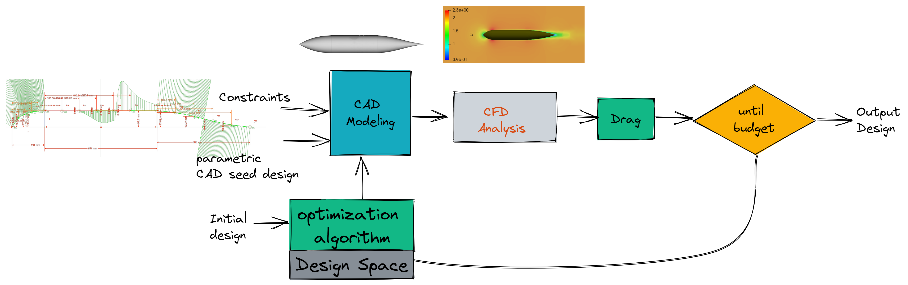
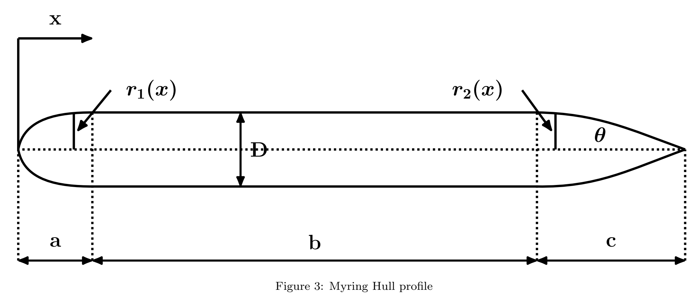

# Surrogate_based_optim_of_UUV_hull

## How to use the code: 
For running you need to install two docker container 
1. Docker to run CFD: can be downloded from [here](https://hub.docker.com/r/kishorestevens/dexof/tags)
2. Docker to run CAD design and assembly from [here](https://hub.docker.com/r/vardhah/freecad) 

Once both dockers are installed, you need to install optimization algotrithms. Currently the tool supports following optimization frameworks: 
1. Bayesian optimization : For this we use [GpyOPT](http://sheffieldml.github.io/GPyOpt/)
2. [PyMoo](https://pymoo.org/): Most tradional algorithms are implemented in this python package. We used GA and Nealder Mead but extending it to other algorithms available in pyMoo is also very easy.  

Last thing we need is a parametic CAD seed design. We designed a parametric CAD with three body parts- nose, tail and cylindrical body. The seed is fully constrained in the CAD geometry and by changing the parameter various hull chapes can be designed.  For parametric purpose, we chose Myring hull as our design architecture.  

### Folder arrangements: 
There are three important folders:
1. cad_cfd_pipeline_surrogate_data_generation: 
2. Single_shot_optimization:
2. Trained_NN_surrogate_optim_in_loop: 

## Surrogate based design optimization:
